# JavaScript & Node.js Architecture Diagrams - Complete Visual Guide

This document contains beautiful and colorful architectural diagrams that explain the core concepts of JavaScript and Node.js. Each diagram is accompanied by detailed explanations to help you understand the underlying architecture.

## Table of Contents
1. [JavaScript Engine Architecture](#javascript-engine-architecture)
2. [Node.js Complete Architecture](#nodejs-complete-architecture)
3. [Event Loop Detailed Flow](#event-loop-detailed-flow)
4. [Memory Management & Garbage Collection](#memory-management--garbage-collection)
5. [Module System Architecture](#module-system-architecture)
6. [Asynchronous Programming Flow](#asynchronous-programming-flow)
7. [HTTP Request Processing Architecture](#http-request-processing-architecture)
8. [Package Management Ecosystem](#package-management-ecosystem)
9. [Express.js Middleware Pipeline](#expressjs-middleware-pipeline)
10. [Database Integration Architecture](#database-integration-architecture)
11. [Microservices Architecture with Node.js](#microservices-architecture-with-nodejs)
12. [Performance Monitoring Architecture](#performance-monitoring-architecture)

---

## JavaScript Engine Architecture

This diagram shows how JavaScript code is processed by the V8 engine, from parsing to execution.

```mermaid
graph TB
    subgraph "JavaScript Engine (V8) - Complete Architecture"
        subgraph "🔍 Parsing Phase"
            Source["📄 JavaScript Source Code<br/>function add(a, b) { return a + b; }"]
            Lexer["🔤 Lexical Analyzer<br/>Tokenizes source code<br/>Keywords, operators, literals"]
            Parser["🌳 Parser<br/>Creates Abstract Syntax Tree<br/>Syntax validation"]
            AST["📊 Abstract Syntax Tree<br/>Tree representation<br/>of code structure"]
        end
        
        subgraph "⚡ Compilation & Execution"
            Ignition["🔥 Ignition Interpreter<br/>• Generates bytecode<br/>• Fast startup<br/>• Memory efficient"]
            Bytecode["📝 Bytecode<br/>Platform-independent<br/>intermediate representation"]
            TurboFan["🚀 TurboFan Compiler<br/>• JIT compilation<br/>• Optimizes hot code<br/>• Machine code generation"]
            OptimizedCode["⚡ Optimized Machine Code<br/>Native CPU instructions<br/>Maximum performance"]
            Deoptimization["🔄 Deoptimization<br/>Falls back to interpreter<br/>when assumptions fail"]
        end
        
        subgraph "🧠 Memory Management"
            Heap["💾 Heap Memory<br/>• Object storage<br/>• Dynamic allocation<br/>• Garbage collected"]
            Stack["📚 Call Stack<br/>• Function calls<br/>• Local variables<br/>• Execution context"]
            
            subgraph "Heap Structure"
                NewSpace["🆕 New Space<br/>Recently created objects<br/>Fast allocation"]
                OldSpace["👴 Old Space<br/>Long-lived objects<br/>Survived GC cycles"]
                LargeSpace["🏗️ Large Object Space<br/>Objects > 1MB<br/>Special handling"]
                CodeSpace["💻 Code Space<br/>Compiled code<br/>JIT generated"]
            end
        end
        
        subgraph "🗑️ Garbage Collection"
            MinorGC["🧹 Minor GC (Scavenger)<br/>• Cleans New Space<br/>• Fast & frequent<br/>• Copying collector"]
            MajorGC["🧽 Major GC (Mark-Sweep)<br/>• Cleans Old Space<br/>• Mark-sweep-compact<br/>• Less frequent"]
            IncrementalGC["📈 Incremental GC<br/>• Reduces pause times<br/>• Interleaved with execution<br/>• Better user experience"]
        end
    end
    
    Source --> Lexer
    Lexer --> Parser
    Parser --> AST
    AST --> Ignition
    Ignition --> Bytecode
    Bytecode --> TurboFan
    TurboFan --> OptimizedCode
    OptimizedCode --> Deoptimization
    Deoptimization --> Ignition
    
    Ignition --> Heap
    Ignition --> Stack
    
    Heap --> NewSpace
    Heap --> OldSpace
    Heap --> LargeSpace
    Heap --> CodeSpace
    
    NewSpace --> MinorGC
    OldSpace --> MajorGC
    MinorGC --> IncrementalGC
    MajorGC --> IncrementalGC
    
    style Source fill:#e3f2fd,stroke:#1976d2,stroke-width:3px
    style Lexer fill:#fff3e0,stroke:#f57c00,stroke-width:2px
    style Parser fill:#e8f5e8,stroke:#388e3c,stroke-width:2px
    style AST fill:#fce4ec,stroke:#c2185b,stroke-width:2px
    style Ignition fill:#f3e5f5,stroke:#7b1fa2,stroke-width:3px
    style TurboFan fill:#e0f2f1,stroke:#00695c,stroke-width:3px
    style OptimizedCode fill:#fff8e1,stroke:#f9a825,stroke-width:3px
    style Heap fill:#ffebee,stroke:#d32f2f,stroke-width:2px
    style Stack fill:#e8eaf6,stroke:#303f9f,stroke-width:2px
    style MinorGC fill:#e0f7fa,stroke:#0097a7,stroke-width:2px
    style MajorGC fill:#fce4ec,stroke:#ad1457,stroke-width:2px
```

### 🔍 Understanding the V8 Engine Flow

**Phase 1: Parsing**
- **Source Code**: Your JavaScript code enters the engine
- **Lexical Analyzer**: Breaks code into tokens (keywords, operators, literals)
- **Parser**: Creates an Abstract Syntax Tree (AST) representing code structure
- **AST**: Tree-like representation that captures the syntax and semantics

**Phase 2: Compilation & Execution**
- **Ignition Interpreter**: Generates bytecode for fast startup and memory efficiency
- **Bytecode**: Platform-independent intermediate representation
- **TurboFan Compiler**: JIT (Just-In-Time) compiler that optimizes frequently executed code
- **Optimized Code**: Native machine code for maximum performance
- **Deoptimization**: Falls back to interpreter when optimization assumptions fail

**Phase 3: Memory Management**
- **Heap**: Dynamic memory for objects, managed by garbage collector
- **Call Stack**: Manages function calls and execution contexts
- **Memory Spaces**: Different areas optimized for different object lifecycles

**Phase 4: Garbage Collection**
- **Minor GC**: Frequent, fast cleanup of short-lived objects
- **Major GC**: Less frequent cleanup of long-lived objects
- **Incremental GC**: Reduces pause times by spreading work across multiple cycles

---

## Node.js Complete Architecture

This comprehensive diagram shows all layers of Node.js architecture and how they interact.

```mermaid
graph TB
    subgraph "🌟 Node.js Complete Architecture Stack"
        subgraph "👨‍💻 Application Layer"
            UserApp["🚀 Your Node.js Application<br/>• Business logic<br/>• API endpoints<br/>• Custom modules"]
            NPMPackages["📦 NPM Packages<br/>• express, lodash, mongoose<br/>• Third-party libraries<br/>• Community modules"]
            CustomModules["🔧 Custom Modules<br/>• Local modules<br/>• Internal libraries<br/>• Shared utilities"]
        end
        
        subgraph "🏗️ Node.js Runtime Layer"
            NodeAPIs["🔌 Node.js APIs<br/>• fs (File System)<br/>• http (HTTP Server/Client)<br/>• crypto (Cryptography)<br/>• path, os, url, etc."]
            
            subgraph "Built-in Modules"
                FS["📁 File System<br/>• Async/sync operations<br/>• Streams support<br/>• Watch capabilities"]
                HTTP["🌐 HTTP Module<br/>• Server creation<br/>• Client requests<br/>• Headers, cookies"]
                Crypto["🔐 Crypto Module<br/>• Hashing, encryption<br/>• Random generation<br/>• Certificates"]
                Events["📢 Events Module<br/>• EventEmitter<br/>• Custom events<br/>• Async patterns"]
            end
        end
        
        subgraph "🔗 Binding Layer"
            CPPBindings["⚙️ C++ Bindings<br/>• Bridge JS ↔ C++<br/>• Performance critical<br/>• System integration"]
            NodeBindings["🔗 Node.js Bindings<br/>• Wrap C++ APIs<br/>• Handle type conversion<br/>• Memory management"]
        end
        
        subgraph "⚡ JavaScript Engine"
            V8Engine["🚀 V8 JavaScript Engine<br/>• Code compilation<br/>• Memory management<br/>• Garbage collection<br/>• JIT optimization"]
            
            subgraph "V8 Components"
                Compiler["⚡ Compiler<br/>• Ignition interpreter<br/>• TurboFan optimizer<br/>• Bytecode generation"]
                Memory["🧠 Memory Manager<br/>• Heap allocation<br/>• Stack management<br/>• GC algorithms"]
                Optimizer["🚀 Optimizer<br/>• Hot code detection<br/>• Inline caching<br/>• Type specialization"]
            end
        end
        
        subgraph "🔄 Event-Driven Core"
            LibUV["🌊 libuv (Event Loop)<br/>• Asynchronous I/O<br/>• Cross-platform<br/>• Thread pool management"]
            
            subgraph "Event Loop Phases"
                Timers["⏰ Timers Phase<br/>setTimeout<br/>setInterval"]
                Pending["⏳ Pending Phase<br/>I/O callbacks"]
                Poll["📥 Poll Phase<br/>Fetch new events<br/>Execute callbacks"]
                Check["✅ Check Phase<br/>setImmediate"]
                Close["❌ Close Phase<br/>Close callbacks"]
            end
            
            subgraph "Thread Pool"
                FileOps["📁 File Operations<br/>• Read/write files<br/>• Directory operations<br/>• File watching"]
                NetworkIO["🌐 Network I/O<br/>• HTTP requests<br/>• TCP/UDP sockets<br/>• DNS resolution"]
                CPUTasks["💻 CPU-Intensive<br/>• Crypto operations<br/>• Compression<br/>• Heavy computations"]
            end
        end
        
        subgraph "💻 Operating System Layer"
            OSKernel["🖥️ Operating System<br/>• Windows, macOS, Linux<br/>• System calls<br/>• Hardware abstraction"]
            
            subgraph "System Resources"
                FileSystem["📂 File System<br/>• Disk I/O<br/>• Permissions<br/>• File metadata"]
                Network["🌍 Network Stack<br/>• TCP/IP<br/>• HTTP/HTTPS<br/>• WebSockets"]
                ProcessMgmt["⚙️ Process Management<br/>• Memory allocation<br/>• CPU scheduling<br/>• Inter-process comm"]
            end
        end
    end
    
    UserApp --> NodeAPIs
    NPMPackages --> NodeAPIs
    CustomModules --> NodeAPIs
    
    NodeAPIs --> FS
    NodeAPIs --> HTTP
    NodeAPIs --> Crypto
    NodeAPIs --> Events
    
    FS --> CPPBindings
    HTTP --> CPPBindings
    Crypto --> CPPBindings
    Events --> CPPBindings
    
    CPPBindings --> NodeBindings
    NodeBindings --> V8Engine
    NodeBindings --> LibUV
    
    V8Engine --> Compiler
    V8Engine --> Memory
    V8Engine --> Optimizer
    
    LibUV --> Timers
    LibUV --> Pending
    LibUV --> Poll
    LibUV --> Check
    LibUV --> Close
    
    LibUV --> FileOps
    LibUV --> NetworkIO
    LibUV --> CPUTasks
    
    FileOps --> OSKernel
    NetworkIO --> OSKernel
    CPUTasks --> OSKernel
    
    OSKernel --> FileSystem
    OSKernel --> Network
    OSKernel --> ProcessMgmt
    
    style UserApp fill:#e3f2fd,stroke:#1976d2,stroke-width:3px
    style NPMPackages fill:#e8f5e8,stroke:#388e3c,stroke-width:2px
    style NodeAPIs fill:#fff3e0,stroke:#f57c00,stroke-width:3px
    style V8Engine fill:#fce4ec,stroke:#c2185b,stroke-width:3px
    style LibUV fill:#f3e5f5,stroke:#7b1fa2,stroke-width:3px
    style CPPBindings fill:#e0f2f1,stroke:#00695c,stroke-width:2px
    style OSKernel fill:#fff8e1,stroke:#f9a825,stroke-width:3px
    style Poll fill:#ffebee,stroke:#d32f2f,stroke-width:2px
    style FileOps fill:#e8eaf6,stroke:#303f9f,stroke-width:2px
```

### 🏗️ Understanding Node.js Architecture Layers

**Layer 1: Application Layer**
- **Your Application**: Contains your business logic, API endpoints, and custom modules
- **NPM Packages**: Third-party libraries from the npm registry (express, lodash, etc.)
- **Custom Modules**: Your own reusable modules and internal libraries

**Layer 2: Node.js Runtime Layer**
- **Node.js APIs**: Built-in modules like fs, http, crypto, path, os, url
- **Core Modules**: Provide essential functionality for file I/O, networking, cryptography
- **Standard Library**: Comprehensive set of modules for common tasks

**Layer 3: Binding Layer**
- **C++ Bindings**: Bridge between JavaScript and native C++ code
- **Type Conversion**: Handles data type conversion between JS and C++
- **Memory Management**: Manages memory allocation and cleanup

**Layer 4: JavaScript Engine (V8)**
- **Code Compilation**: Compiles JavaScript to bytecode and optimized machine code
- **Memory Management**: Handles heap allocation, garbage collection
- **JIT Optimization**: Just-in-time compilation for performance

**Layer 5: Event-Driven Core (libuv)**
- **Event Loop**: Single-threaded event loop for non-blocking I/O
- **Thread Pool**: Background threads for file operations and CPU-intensive tasks
- **Cross-Platform**: Provides platform abstraction layer

**Layer 6: Operating System**
- **System Calls**: Interface with the underlying operating system
- **Hardware Abstraction**: Provides access to file system, network, processes
- **Resource Management**: CPU scheduling, memory allocation, I/O operations

---

## Event Loop Detailed Flow

This diagram shows the complete event loop cycle with all phases and their interactions.

```mermaid
graph TD
    subgraph "🔄 Node.js Event Loop - Complete Cycle"
        Start([🚀 Event Loop Start<br/>Single-threaded execution])
        
        subgraph "📋 Microtasks Queue (Highest Priority)"
            NextTick["🔄 process.nextTick()<br/>• Highest priority<br/>• Executes immediately<br/>• Can starve other phases"]
            Promises["🤝 Promise Callbacks<br/>• .then(), .catch(), .finally()<br/>• Microtask queue<br/>• After nextTick"]
        end
        
        subgraph "⏰ Phase 1: Timers"
            TimerPhase["⏰ Timer Phase<br/>• setTimeout() callbacks<br/>• setInterval() callbacks<br/>• Expired timers only"]
            TimerQueue["📅 Timer Queue<br/>• Min-heap structure<br/>• Sorted by expiration<br/>• System time based"]
        end
        
        subgraph "⏳ Phase 2: Pending Callbacks"
            PendingPhase["⏳ Pending I/O Callbacks<br/>• Deferred I/O callbacks<br/>• Error callbacks<br/>• Some TCP errors"]
            PendingQueue["📋 Pending Queue<br/>• Previously deferred<br/>• System-specific<br/>• Error handling"]
        end
        
        subgraph "😴 Phase 3: Idle, Prepare"
            IdlePhase["😴 Idle & Prepare<br/>• Internal libuv use<br/>• Housekeeping tasks<br/>• Not user-accessible"]
        end
        
        subgraph "📥 Phase 4: Poll (Most Important)"
            PollPhase["📥 Poll Phase<br/>• Fetch new I/O events<br/>• Execute I/O callbacks<br/>• Block if no timers"]
            PollQueue["📊 Poll Queue<br/>• File operations<br/>• Network operations<br/>• Most callbacks here"]
            
            subgraph "Poll Phase Logic"
                CheckTimers["⏰ Check Timers<br/>If timers ready,<br/>go to Timer phase"]
                CheckImmediate["✅ Check setImmediate<br/>If immediate callbacks,<br/>go to Check phase"]
                WaitForEvents["⏳ Wait for Events<br/>Block for I/O<br/>with timeout"]
            end
        end
        
        subgraph "✅ Phase 5: Check"
            CheckPhase["✅ Check Phase<br/>• setImmediate() callbacks<br/>• Executes after Poll<br/>• Higher priority than timers"]
            ImmediateQueue["⚡ Immediate Queue<br/>• FIFO queue<br/>• Executes once per loop<br/>• After I/O events"]
        end
        
        subgraph "❌ Phase 6: Close Callbacks"
            ClosePhase["❌ Close Callbacks<br/>• socket.on('close')<br/>• server.on('close')<br/>• Cleanup operations"]
            CloseQueue["🗑️ Close Queue<br/>• Resource cleanup<br/>• Connection termination<br/>• Memory deallocation"]
        end
        
        subgraph "🧵 Thread Pool (Background)"
            FileOps["📁 File Operations<br/>• fs.readFile()<br/>• fs.writeFile()<br/>• Directory operations"]
            DNSLookup["🌐 DNS Lookups<br/>• dns.lookup()<br/>• Hostname resolution<br/>• Network queries"]
            CPUIntensive["💻 CPU Work<br/>• crypto operations<br/>• zlib compression<br/>• Heavy computations"]
            CustomWork["⚙️ Custom Work<br/>• Worker threads<br/>• Child processes<br/>• Native addons"]
        end
        
        subgraph "📊 Event Loop Monitoring"
            LoopLag["📈 Loop Lag<br/>• Measures delay<br/>• Performance indicator<br/>• Blocking detection"]
            ActiveHandles["🎛️ Active Handles<br/>• Open connections<br/>• Pending operations<br/>• Keep-alive check"]
        end
    end
    
    Start --> NextTick
    NextTick --> Promises
    Promises --> TimerPhase
    TimerPhase --> TimerQueue
    TimerQueue --> PendingPhase
    PendingPhase --> PendingQueue
    PendingQueue --> IdlePhase
    IdlePhase --> PollPhase
    PollPhase --> PollQueue
    PollQueue --> CheckTimers
    CheckTimers --> CheckImmediate
    CheckImmediate --> WaitForEvents
    WaitForEvents --> CheckPhase
    CheckPhase --> ImmediateQueue
    ImmediateQueue --> ClosePhase
    ClosePhase --> CloseQueue
    CloseQueue --> Start
    
    PollPhase -.-> FileOps
    PollPhase -.-> DNSLookup
    PollPhase -.-> CPUIntensive
    PollPhase -.-> CustomWork
    
    FileOps -.-> PollQueue
    DNSLookup -.-> PollQueue
    CPUIntensive -.-> PollQueue
    CustomWork -.-> PollQueue
    
    TimerPhase -.-> NextTick
    PendingPhase -.-> NextTick
    PollPhase -.-> NextTick
    CheckPhase -.-> NextTick
    ClosePhase -.-> NextTick
    
    Start -.-> LoopLag
    Start -.-> ActiveHandles
    
    style Start fill:#4caf50,stroke:#2e7d32,stroke-width:4px
    style NextTick fill:#ffeb3b,stroke:#f57f17,stroke-width:3px
    style Promises fill:#00bcd4,stroke:#0097a7,stroke-width:3px
    style TimerPhase fill:#ff9800,stroke:#ef6c00,stroke-width:3px
    style PendingPhase fill:#2196f3,stroke:#1565c0,stroke-width:2px
    style IdlePhase fill:#9e9e9e,stroke:#424242,stroke-width:2px
    style PollPhase fill:#e91e63,stroke:#ad1457,stroke-width:4px
    style CheckPhase fill:#9c27b0,stroke:#6a1b9a,stroke-width:3px
    style ClosePhase fill:#f44336,stroke:#c62828,stroke-width:2px
    style FileOps fill:#e8f5e8,stroke:#388e3c,stroke-width:2px
    style DNSLookup fill:#e3f2fd,stroke:#1976d2,stroke-width:2px
    style LoopLag fill:#fff3e0,stroke:#f57c00,stroke-width:2px
```

### 🔄 Understanding the Event Loop Phases

**Microtasks (Highest Priority)**
- **process.nextTick()**: Executes before any other phase, can starve the event loop
- **Promise Callbacks**: .then(), .catch(), .finally() - executed after nextTick but before other phases

**Phase 1: Timers (⏰)**
- Executes callbacks scheduled by `setTimeout()` and `setInterval()`
- Only executes timers whose threshold has elapsed
- Uses a min-heap data structure sorted by expiration time

**Phase 2: Pending Callbacks (⏳)**
- Executes I/O callbacks deferred to the next loop iteration
- Handles some system operation errors (e.g., TCP errors)
- Mostly internal libuv operations

**Phase 3: Idle, Prepare (😴)**
- Used internally by libuv for housekeeping
- Not directly accessible by user code
- Prepares for the poll phase

**Phase 4: Poll (📥) - Most Important**
- Fetches new I/O events and executes their callbacks
- Blocks and waits for new connections, data, etc.
- Contains the logic that determines how long to block
- Most application callbacks execute here

**Phase 5: Check (✅)**
- Executes `setImmediate()` callbacks
- Allows callbacks to be executed immediately after the poll phase
- Higher priority than timers in the next iteration

**Phase 6: Close Callbacks (❌)**
- Executes close event callbacks (e.g., `socket.on('close')`)
- Handles cleanup operations and resource deallocation

**Thread Pool Operations (🧵)**
- File operations run on background threads
- DNS lookups and CPU-intensive tasks
- Results are queued back to the main thread

**Key Concepts:**
- **Non-blocking**: The event loop never blocks on I/O
- **Single-threaded**: Main execution thread, but uses thread pool for I/O
- **Priority**: Microtasks > Timers > I/O > setImmediate > Close callbacks

---

## Memory Management & Garbage Collection

This diagram illustrates how V8 manages memory and performs garbage collection.

```mermaid
graph TB
    subgraph "🧠 V8 Memory Management Architecture"
        subgraph "📚 Call Stack"
            StackFrame1["📋 Function Call 1<br/>• Local variables<br/>• Parameters<br/>• Return address"]
            StackFrame2["📋 Function Call 2<br/>• Execution context<br/>• Scope chain<br/>• 'this' binding"]
            StackFrame3["📋 Function Call 3<br/>• Current executing<br/>• LIFO structure<br/>• Stack overflow check"]
            
            StackFrame3 --> StackFrame2
            StackFrame2 --> StackFrame1
        end
        
        subgraph "💾 Heap Memory (Dynamic Allocation)"
            subgraph "🆕 Young Generation (Short-lived objects)"
                NewSpace["🌱 New Space (Eden)<br/>• Recently allocated objects<br/>• Fast allocation (bump pointer)<br/>• 1-8MB typical size"]
                
                subgraph "Survivor Spaces"
                    SurvivorFrom["🏃 Survivor From Space<br/>• Objects that survived 1 GC<br/>• Semi-space copying<br/>• Promotion candidates"]
                    SurvivorTo["🏃 Survivor To Space<br/>• Currently empty<br/>• Target for copying<br/>• Swaps with From space"]
                end
            end
            
            subgraph "👴 Old Generation (Long-lived objects)"
                OldPointer["🎯 Old Pointer Space<br/>• Objects with pointers<br/>• Survived multiple GCs<br/>• Mark-sweep collection"]
                OldData["📊 Old Data Space<br/>• Objects without pointers<br/>• Raw data, strings<br/>• More efficient collection"]
                LargeObject["🏗️ Large Object Space<br/>• Objects > 1MB<br/>• Direct allocation<br/>• Special handling"]
                CodeSpace["💻 Code Space<br/>• Compiled JavaScript<br/>• JIT generated code<br/>• Executable memory"]
            end
        end
        
        subgraph "🗑️ Garbage Collection Algorithms"
            subgraph "🧹 Minor GC (Scavenger)"
                ScavengeStart["🚀 Scavenge Start<br/>• Triggered when New Space full<br/>• Very frequent (every few MB)<br/>• Fast execution (< 10ms)"]
                
                CopyAlgorithm["📋 Copy Algorithm<br/>• Copy live objects<br/>• From New → Survivor<br/>• From Survivor → Old"]
                
                SpaceSwap["🔄 Space Swap<br/>• Survivor spaces swap roles<br/>• From becomes To<br/>• To becomes From"]
                
                Promotion["⬆️ Age-based Promotion<br/>• Objects surviving 2+ GCs<br/>• Move to Old Generation<br/>• Reduce future GC work"]
            end
            
            subgraph "🧽 Major GC (Mark-Sweep-Compact)"
                MarkPhase["🏷️ Mark Phase<br/>• Mark reachable objects<br/>• Traverse object graph<br/>• Start from GC roots"]
                
                SweepPhase["🧹 Sweep Phase<br/>• Deallocate unmarked<br/>• Free memory chunks<br/>• Update free lists"]
                
                CompactPhase["📦 Compact Phase<br/>• Defragment memory<br/>• Move objects together<br/>• Reduce fragmentation"]
                
                IncrementalGC["📈 Incremental GC<br/>• Interleaved with execution<br/>• Reduce pause times<br/>• Write barriers track changes"]
                
                ConcurrentGC["🔄 Concurrent GC<br/>• Background threads<br/>• Parallel to main thread<br/>• Minimal pause times"]
            end
        end
    end
    
    NewSpace --> SurvivorFrom
    SurvivorFrom --> SurvivorTo
    SurvivorTo --> OldPointer
    SurvivorFrom --> OldData
    
    NewSpace --> ScavengeStart
    ScavengeStart --> CopyAlgorithm
    CopyAlgorithm --> SpaceSwap
    SpaceSwap --> Promotion
    
    OldPointer --> MarkPhase
    OldData --> MarkPhase
    MarkPhase --> SweepPhase
    SweepPhase --> CompactPhase
    CompactPhase --> IncrementalGC
    IncrementalGC --> ConcurrentGC
    
    style NewSpace fill:#e8f5e8,stroke:#388e3c,stroke-width:3px
    style SurvivorFrom fill:#fff3e0,stroke:#f57c00,stroke-width:2px
    style SurvivorTo fill:#fce4ec,stroke:#c2185b,stroke-width:2px
    style OldPointer fill:#f3e5f5,stroke:#7b1fa2,stroke-width:3px
    style LargeObject fill:#e0f2f1,stroke:#00695c,stroke-width:2px
    style ScavengeStart fill:#e3f2fd,stroke:#1976d2,stroke-width:3px
    style MarkPhase fill:#ffebee,stroke:#d32f2f,stroke-width:3px
    style IncrementalGC fill:#e8eaf6,stroke:#303f9f,stroke-width:2px
```

### 🧠 Understanding V8 Memory Architecture

**Call Stack (📚)**
- **Function Frames**: Each function call creates a stack frame
- **LIFO Structure**: Last In, First Out execution order
- **Local Variables**: Function parameters and local variables stored here
- **Stack Overflow**: Occurs when stack grows too large (deep recursion)

**Heap Memory (💾)**
The heap is divided into different spaces optimized for different object lifecycles:

**Young Generation (🆕)**
- **New Space**: Where objects are initially allocated (1-8MB)
- **Survivor Spaces**: Two spaces that swap roles during GC
- **Fast Allocation**: Uses bump pointer allocation for speed
- **High Turnover**: Most objects die young and are quickly collected

**Old Generation (👴)**
- **Old Pointer Space**: Objects with references to other objects
- **Old Data Space**: Objects without pointers (strings, numbers)
- **Large Object Space**: Objects larger than 1MB
- **Code Space**: Compiled JavaScript and JIT-generated machine code

**Garbage Collection Algorithms (🗑️)**

**Minor GC (Scavenger) - Fast & Frequent**
- **Trigger**: When New Space fills up
- **Algorithm**: Cheney's copying algorithm
- **Speed**: Very fast (< 10ms typically)
- **Frequency**: Every few MB of allocation

**Major GC (Mark-Sweep-Compact) - Thorough but Slower**
- **Mark Phase**: Identifies reachable objects from GC roots
- **Sweep Phase**: Deallocates unreachable objects
- **Compact Phase**: Defragments memory to reduce fragmentation
- **Incremental**: Spreads work across multiple cycles
- **Concurrent**: Runs on background threads when possible

**Memory Optimization Techniques (⚡)**
- **Hidden Classes**: Optimize property access patterns
- **String Interning**: Deduplicate identical strings
- **Pointer Compression**: Use 32-bit pointers on 64-bit systems
- **Inline Caching**: Speed up property access

**Memory Monitoring (🚨)**
- **GC Triggers**: Heap size, allocation rate, time-based
- **Memory Pressure**: System-wide memory constraints
- **OOM Handling**: Out-of-memory error management

---

## Module System Architecture

This diagram shows how Node.js resolves and loads modules.

```mermaid
graph TB
    subgraph "📦 Node.js Module System Architecture"
        subgraph "🎯 Module Types"
            BuiltInModules["🏗️ Built-in Modules<br/>• fs, http, path, crypto<br/>• Compiled into Node.js<br/>• No file system access<br/>• Always available"]
            
            LocalModules["📁 Local Modules<br/>• ./module, ../module<br/>• Relative paths<br/>• Your custom modules<br/>• Project-specific code"]
            
            NodeModules["📦 Node Modules<br/>• express, lodash, react<br/>• Third-party packages<br/>• From npm registry<br/>• Version managed"]
        end
        
        subgraph "🔍 Module Resolution Algorithm"
            ResolutionStart["🚀 require('module-name')<br/>Start resolution process"]
            
            subgraph "Step 1: Core Module Check"
                CoreCheck["🔍 Check Core Modules<br/>• Is it 'fs', 'http', etc.?<br/>• Highest priority<br/>• Return immediately"]
            end
            
            subgraph "Step 2: Path-based Resolution"
                PathCheck["📂 Check if path starts with<br/>• './' (relative)<br/>• '../' (parent)<br/>• '/' (absolute)"]
                FileResolution["📄 Resolve as File<br/>• Try exact filename<br/>• Try with .js extension<br/>• Try with .json extension<br/>• Try with .node extension"]
                DirResolution["📁 Resolve as Directory<br/>• Look for package.json<br/>• Check 'main' field<br/>• Try index.js<br/>• Try index.json"]
            end
            
            subgraph "Step 3: Node Modules Traversal"
                NodeModulesSearch["🔍 Search node_modules<br/>• Current directory first<br/>• Walk up directory tree<br/>• Check each parent dir"]
                GlobalModules["🌍 Global Modules<br/>• System-wide installation<br/>• Last resort<br/>• Not recommended"]
            end
            
            ResolutionError["❌ MODULE_NOT_FOUND<br/>• All resolution failed<br/>• Throw error<br/>• Show resolution paths"]
        end
        
        subgraph "💾 Module Cache System"
            RequireCache["🗃️ require.cache<br/>• Singleton pattern<br/>• Absolute path keys<br/>• Module objects stored"]
            
            CacheHit["✅ Cache Hit<br/>• Return cached module<br/>• No re-execution<br/>• Same instance"]
            
            CacheMiss["❌ Cache Miss<br/>• Load and compile<br/>• Store in cache<br/>• Return new instance"]
        end
    end
    
    ResolutionStart --> CoreCheck
    CoreCheck --> PathCheck
    PathCheck --> FileResolution
    FileResolution --> DirResolution
    DirResolution --> NodeModulesSearch
    NodeModulesSearch --> GlobalModules
    GlobalModules --> ResolutionError
    
    ResolutionStart --> RequireCache
    RequireCache --> CacheHit
    RequireCache --> CacheMiss
    
    style BuiltInModules fill:#e3f2fd,stroke:#1976d2,stroke-width:3px
    style LocalModules fill:#e8f5e8,stroke:#388e3c,stroke-width:2px
    style NodeModules fill:#fff3e0,stroke:#f57c00,stroke-width:3px
    style CoreCheck fill:#fce4ec,stroke:#c2185b,stroke-width:2px
    style RequireCache fill:#f3e5f5,stroke:#7b1fa2,stroke-width:3px
    style CacheHit fill:#e0f2f1,stroke:#00695c,stroke-width:2px
```

### 📦 Understanding Node.js Module Resolution

**Module Types (🎯)**
- **Built-in Modules**: Core Node.js modules (fs, http, etc.) compiled into the runtime
- **Local Modules**: Your custom modules using relative paths (./module, ../module)
- **Node Modules**: Third-party packages from npm registry
- **JSON Modules**: Configuration files loaded as JavaScript objects

**Resolution Algorithm (🔍)**
Node.js follows a specific algorithm to find modules:

1. **Core Module Check**: First checks if it's a built-in module
2. **Path Resolution**: For relative/absolute paths, resolves as file or directory
3. **Node Modules Search**: Traverses up directory tree looking for node_modules
4. **Global Modules**: Last resort, checks globally installed modules

**Module Cache (💾)**
- **Singleton Pattern**: Each module is loaded only once
- **Cache Hit**: Returns cached module instance for subsequent requires
- **Cache Miss**: Loads, compiles, and caches new modules
- **Cache Invalidation**: Can be cleared for testing/hot reloading

**Loading Process (⚙️)**
1. **File Read**: Load source code from file system
2. **Module Wrapper**: Wrap code in function with context (exports, require, etc.)
3. **Compilation**: Parse and compile JavaScript to bytecode
4. **Execution**: Run module code and set up exports
5. **Return Exports**: Make module.exports available to requirer

**CommonJS vs ES Modules (🔄)**
- **CommonJS**: Traditional Node.js modules with require()/module.exports
- **ES Modules**: Modern standard with import/export syntax
- **Interoperability**: Node.js provides ways to use both systems together

**Performance Considerations (📊)**
- **Circular Dependencies**: Can cause incomplete loading, should be avoided
- **Lazy Loading**: Load modules only when needed to improve startup time
- **Bundling**: Use tools like Webpack for production optimization

---

## Asynchronous Programming Flow

This diagram illustrates the different patterns for handling asynchronous operations in JavaScript.

```mermaid
graph TB
    subgraph "🔄 Asynchronous JavaScript Evolution"
        subgraph "📞 Callback Pattern (Legacy)"
            CallbackStart["🚀 Callback Function<br/>function(error, result) {<br/>  // Handle result or error<br/>}"]
            
            CallbackHell["😱 Callback Hell<br/>getData(function(a) {<br/>  getMoreData(a, function(b) {<br/>    getMoreData(b, function(c) {<br/>      // Pyramid of doom!<br/>    });<br/>  });<br/>});"]
        end
        
        subgraph "🤝 Promise Pattern (ES6)"
            PromiseStates["📊 Promise States<br/>• Pending: initial state<br/>• Fulfilled: operation succeeded<br/>• Rejected: operation failed<br/>• Immutable once settled"]
            
            PromiseChain["⛓️ Promise Chaining<br/>getData()<br/>  .then(result => processResult(result))<br/>  .then(processed => saveResult(processed))<br/>  .catch(error => handleError(error))<br/>  .finally(() => cleanup());"]
            
            PromiseCombinators["🎯 Promise Combinators<br/>• Promise.all() - wait for all<br/>• Promise.race() - first to settle<br/>• Promise.allSettled() - all results<br/>• Promise.any() - first fulfilled"]
        end
        
        subgraph "⚡ Async/Await Pattern (ES2017)"
            AsyncFunction["🔧 Async Functions<br/>async function fetchData() {<br/>  // Always returns Promise<br/>  // Can use await inside<br/>}"]
            
            AwaitKeyword["⏳ Await Keyword<br/>const result = await fetchData();<br/>• Pauses function execution<br/>• Waits for Promise to settle<br/>• Returns resolved value"]
            
            TryCatchAsync["🛡️ Error Handling<br/>try {<br/>  const data = await fetchData();<br/>  return processData(data);<br/>} catch (error) {<br/>  console.error(error);<br/>  throw error;<br/>}"]
        end
        
        subgraph "⚡ Event Loop Integration"
            MacroTasks["📋 Macrotask Queue<br/>• setTimeout, setInterval<br/>• I/O operations<br/>• UI events<br/>• Lower priority"]
            
            MicroTasks["🔬 Microtask Queue<br/>• Promise.then/catch/finally<br/>• process.nextTick (Node.js)<br/>• queueMicrotask()<br/>• Higher priority"]
            
            ExecutionOrder["📈 Execution Priority<br/>1. Synchronous code<br/>2. Microtasks (Promise callbacks)<br/>3. Macrotasks (setTimeout, etc.)<br/>4. Repeat cycle"]
        end
    end
    
    CallbackStart --> CallbackHell
    CallbackHell --> PromiseStates
    PromiseStates --> PromiseChain
    PromiseChain --> PromiseCombinators
    PromiseStates --> AsyncFunction
    AsyncFunction --> AwaitKeyword
    AwaitKeyword --> TryCatchAsync
    
    PromiseStates -.-> MicroTasks
    MacroTasks --> ExecutionOrder
    MicroTasks --> ExecutionOrder
    
    style CallbackHell fill:#ffcdd2,stroke:#d32f2f,stroke-width:3px
    style PromiseStates fill:#e8f5e8,stroke:#388e3c,stroke-width:3px
    style AsyncFunction fill:#e3f2fd,stroke:#1976d2,stroke-width:3px
    style AwaitKeyword fill:#fff3e0,stroke:#f57c00,stroke-width:2px
    style MicroTasks fill:#fce4ec,stroke:#c2185b,stroke-width:3px
    style MacroTasks fill:#f3e5f5,stroke:#7b1fa2,stroke-width:2px
    style ExecutionOrder fill:#e0f2f1,stroke:#00695c,stroke-width:3px
```

### 🔄 Evolution of Asynchronous JavaScript

**Callback Pattern (📞) - The Beginning**
- **Error-First Convention**: Standard Node.js pattern with error as first parameter
- **Callback Hell**: Nested callbacks creating pyramid of doom
- **Difficult Error Handling**: Error propagation becomes complex
- **Inversion of Control**: You give control to the callback

**Promise Pattern (🤝) - The Improvement**
- **Three States**: Pending, Fulfilled, Rejected - immutable once settled
- **Chainable**: .then(), .catch(), .finally() for sequential operations
- **Combinators**: Promise.all(), race(), allSettled(), any() for parallel operations
- **Better Error Handling**: Errors propagate down the chain

**Async/Await Pattern (⚡) - The Modern Way**
- **Synchronous-like Syntax**: Write asynchronous code that looks synchronous
- **Error Handling**: Use familiar try-catch blocks
- **Parallel Execution**: Combine with Promise.all() for concurrent operations
- **Function Context**: Maintains function scope and this binding

**Advanced Patterns (🎭)**
- **Async Iterators**: Process streams of data asynchronously
- **Async Pipelines**: Chain async operations functionally
- **Concurrency Control**: Manage parallel operation limits

**Event Loop Integration (⚡)**
- **Microtasks**: High-priority queue (Promise callbacks, process.nextTick)
- **Macrotasks**: Lower-priority queue (setTimeout, I/O operations)
- **Execution Order**: Sync code → Microtasks → Macrotasks → Repeat

**Error Handling Strategies (🚨)**
- **Local Handling**: Try-catch and .catch() for specific operations
- **Error Boundaries**: Graceful degradation and recovery
- **Global Handlers**: Last resort for unhandled errors

**Async Utilities (🔧)**
- **Promise Utilities**: Helper functions for common patterns
- **Async Queues**: Sequential processing with concurrency control
- **Async Caching**: Memoization for expensive async operations

---

## HTTP Request Processing Architecture

This diagram shows how Node.js processes HTTP requests from client to response.

```mermaid
graph TB
    subgraph "🌐 HTTP Request Processing in Node.js"
        subgraph "👤 Client Side"
            Client["🖥️ Client Application<br/>• Browser<br/>• Mobile app<br/>• API client<br/>• Postman, curl"]
            
            HTTPRequest["📤 HTTP Request<br/>• Method: GET, POST, PUT, DELETE<br/>• Headers: Content-Type, Authorization<br/>• Body: JSON, form data, files<br/>• URL: /api/users/123"]
        end
        
        subgraph "🌍 Network Layer"
            Internet["🌐 Internet/Network<br/>• TCP/IP protocol<br/>• DNS resolution<br/>• Load balancers<br/>• CDN, proxies"]
            
            TLS["🔒 TLS/SSL Layer<br/>• HTTPS encryption<br/>• Certificate validation<br/>• Handshake process<br/>• Secure communication"]
        end
        
        subgraph "🚀 Node.js Server"
            subgraph "📥 HTTP Server Layer"
                HTTPServer["🌐 HTTP Server<br/>• http.createServer()<br/>• Port binding (80, 443, 3000)<br/>• Connection handling<br/>• Keep-alive management"]
                
                RequestParser["🔍 Request Parser<br/>• Parse HTTP headers<br/>• Extract URL parameters<br/>• Handle request body<br/>• Validate format"]
            end
            
            subgraph "🛣️ Routing Layer"
                Router["🗺️ URL Router<br/>• Route matching<br/>• Path parameters extraction<br/>• Query string parsing<br/>• Method validation"]
                
                RouteHandlers["🎯 Route Handlers<br/>• GET /api/users<br/>• POST /api/users<br/>• PUT /api/users/:id<br/>• DELETE /api/users/:id"]
            end
            
            subgraph "🔧 Middleware Pipeline"
                AuthMiddleware["🔐 Authentication<br/>• JWT validation<br/>• Session management<br/>• API key verification<br/>• User identification"]
                
                ValidationMiddleware["✅ Validation<br/>• Input sanitization<br/>• Schema validation<br/>• Type checking<br/>• Security filtering"]
            end
            
            subgraph "🎮 Controller Layer"
                Controllers["🎛️ Controllers<br/>• Business logic<br/>• Request handling<br/>• Response formatting<br/>• Error handling"]
                
                ServiceLayer["⚙️ Service Layer<br/>• Business rules<br/>• Data processing<br/>• External API calls<br/>• Calculations"]
            end
            
            subgraph "💾 Data Layer"
                Database["🗄️ Database<br/>• MongoDB, PostgreSQL<br/>• Query execution<br/>• Transactions<br/>• Connection pooling"]
                
                Cache["⚡ Cache Layer<br/>• Redis, Memcached<br/>• Session storage<br/>• Query caching<br/>• Performance boost"]
            end
        end
        
        subgraph "🔄 Event Loop Integration"
            EventLoop["⚡ Event Loop<br/>• Non-blocking I/O<br/>• Async operations<br/>• Callback queuing<br/>• Performance optimization"]
            
            ThreadPool["🧵 Thread Pool<br/>• Database queries<br/>• File operations<br/>• CPU-intensive tasks<br/>• Background processing"]
        end
    end
    
    Client --> HTTPRequest
    HTTPRequest --> Internet
    Internet --> TLS
    TLS --> HTTPServer
    
    HTTPServer --> RequestParser
    RequestParser --> Router
    Router --> RouteHandlers
    
    RouteHandlers --> AuthMiddleware
    AuthMiddleware --> ValidationMiddleware
    ValidationMiddleware --> Controllers
    Controllers --> ServiceLayer
    
    ServiceLayer --> Database
    ServiceLayer --> Cache
    
    Database -.-> ThreadPool
    ThreadPool -.-> EventLoop
    
    ServiceLayer --> HTTPServer
    HTTPServer --> TLS
    TLS --> Internet
    Internet --> Client
    
    style Client fill:#e3f2fd,stroke:#1976d2,stroke-width:3px
    style HTTPServer fill:#e8f5e8,stroke:#388e3c,stroke-width:3px
    style Router fill:#fff3e0,stroke:#f57c00,stroke-width:2px
    style AuthMiddleware fill:#fce4ec,stroke:#c2185b,stroke-width:2px
    style Controllers fill:#f3e5f5,stroke:#7b1fa2,stroke-width:3px
    style Database fill:#e0f2f1,stroke:#00695c,stroke-width:3px
    style EventLoop fill:#fff8e1,stroke:#f9a825,stroke-width:3px
    style ThreadPool fill:#ffebee,stroke:#d32f2f,stroke-width:2px
```

### 🌐 Understanding HTTP Request Flow

**Client Side (👤)**
- **Client Applications**: Browsers, mobile apps, API clients, testing tools
- **HTTP Request**: Contains method, headers, body, and URL information
- **Network Communication**: Travels over internet using TCP/IP protocol

**Network Layer (🌍)**
- **Internet Infrastructure**: Routers, load balancers, CDNs, proxies
- **TLS/SSL**: Encrypts HTTPS traffic for secure communication
- **DNS Resolution**: Converts domain names to IP addresses

**Node.js Server Layers:**

**HTTP Server Layer (📥)**
- **HTTP Server**: Created with http.createServer(), handles connections
- **Request Parser**: Extracts headers, body, URL parameters from raw HTTP

**Routing Layer (🛣️)**
- **URL Router**: Matches incoming requests to appropriate handlers
- **Route Handlers**: Specific functions for different endpoints and methods

**Middleware Pipeline (🔧)**
- **Authentication**: Validates user credentials and permissions
- **CORS**: Handles cross-origin resource sharing policies
- **Logging**: Records request/response information for monitoring
- **Validation**: Sanitizes and validates input data
- **Rate Limiting**: Prevents abuse and DDoS attacks

**Controller Layer (🎮)**
- **Controllers**: Handle business logic and coordinate operations
- **Service Layer**: Contains core business rules and data processing

**Data Layer (💾)**
- **Database**: Persistent data storage (SQL/NoSQL databases)
- **Cache**: Fast temporary storage (Redis, Memcached)
- **File System**: Static files, uploads, logs
- **External APIs**: Third-party service integrations

**Response Generation (📤)**
- **Response Builder**: Creates HTTP response with proper status and headers
- **Serialization**: Converts data to JSON, XML, or other formats
- **Compression**: Reduces response size for better performance

**Event Loop Integration (🔄)**
- **Event Loop**: Manages asynchronous operations without blocking
- **Thread Pool**: Handles I/O operations in background threads

**Monitoring & Observability (📊)**
- **Metrics**: Performance and usage statistics
- **Health Checks**: Service availability monitoring
- **Error Tracking**: Exception handling and alerting

---

## Express.js Middleware Pipeline

This diagram shows how Express.js processes requests through its middleware pipeline.

```mermaid
graph TD
    subgraph "🚀 Express.js Middleware Pipeline Architecture"
        subgraph "📥 Request Entry"
            IncomingRequest["📨 Incoming HTTP Request<br/>• Method: GET, POST, PUT, DELETE<br/>• URL: /api/users/123<br/>• Headers: Content-Type, Authorization<br/>• Body: JSON, form data"]
            
            ExpressApp["⚡ Express Application<br/>• app = express()<br/>• Middleware stack<br/>• Route definitions<br/>• Error handling"]
        end
        
        subgraph "🔧 Global Middleware Stack"
            BodyParser["📋 Body Parser<br/>• express.json()<br/>• express.urlencoded()<br/>• Parses request body<br/>• Available as req.body"]
            
            CookieParser["🍪 Cookie Parser<br/>• cookie-parser<br/>• Parses cookies<br/>• Available as req.cookies<br/>• Signed cookies support"]
            
            SessionMiddleware["🔐 Session Middleware<br/>• express-session<br/>• Session management<br/>• Store in memory/Redis<br/>• Available as req.session"]
            
            CORSMiddleware["🌍 CORS Middleware<br/>• cors package<br/>• Cross-origin policies<br/>• Preflight handling<br/>• Security headers"]
        end
        
        subgraph "🛣️ Routing Middleware"
            RouterLevel["🗺️ Router-Level Middleware<br/>• app.use('/api', middleware)<br/>• Path-specific middleware<br/>• Modular organization<br/>• Route grouping"]
            
            RouteMatching["🎯 Route Matching<br/>• Pattern matching<br/>• Parameter extraction<br/>• Query parsing<br/>• Method validation"]
        end
        
        subgraph "🔐 Authentication & Authorization"
            AuthMiddleware["🔑 Authentication<br/>• Passport.js<br/>• JWT verification<br/>• Session validation<br/>• User identification"]
            
            AuthzMiddleware["👮 Authorization<br/>• Role-based access<br/>• Permission checking<br/>• Resource ownership<br/>• ACL (Access Control)"]
        end
        
        subgraph "✅ Validation & Sanitization"
            ValidationMiddleware["🔍 Input Validation<br/>• express-validator<br/>• Joi validation<br/>• Schema checking<br/>• Type conversion"]
            
            SanitizationMiddleware["🧹 Data Sanitization<br/>• XSS prevention<br/>• SQL injection protection<br/>• Input cleaning<br/>• HTML encoding"]
        end
        
        subgraph "🎮 Route Handlers"
            RouteHandler["🎯 Route Handler<br/>• app.get('/users', handler)<br/>• Business logic<br/>• Controller functions<br/>• Response generation"]
            
            ControllerLogic["🧠 Controller Logic<br/>• Database operations<br/>• Business rules<br/>• Data processing<br/>• External API calls"]
        end
        
        subgraph "📤 Response Processing"
            ResponseMiddleware["📋 Response Processing<br/>• Data transformation<br/>• Format conversion<br/>• Header setting<br/>• Status codes"]
            
            CompressionMiddleware["🗜️ Compression<br/>• compression package<br/>• Gzip encoding<br/>• Response optimization<br/>• Bandwidth saving"]
        end
        
        subgraph "🚨 Error Handling"
            ErrorMiddleware["❌ Error Middleware<br/>• app.use(errorHandler)<br/>• 4 parameters<br/>• Error logging<br/>• Response formatting"]
            
            ErrorResponse["📤 Error Response<br/>• Status codes<br/>• Error messages<br/>• Stack traces (dev)<br/>• User-friendly errors"]
        end
        
        subgraph "🔄 Middleware Flow Control"
            NextFunction["➡️ next() Function<br/>• Continue to next middleware<br/>• next(error) for errors<br/>• Skip remaining middleware<br/>• Flow control"]
        end
    end
    
    IncomingRequest --> ExpressApp
    ExpressApp --> BodyParser
    BodyParser --> CookieParser
    CookieParser --> SessionMiddleware
    SessionMiddleware --> CORSMiddleware
    
    CORSMiddleware --> RouterLevel
    RouterLevel --> RouteMatching
    
    RouteMatching --> AuthMiddleware
    AuthMiddleware --> AuthzMiddleware
    
    AuthzMiddleware --> ValidationMiddleware
    ValidationMiddleware --> SanitizationMiddleware
    
    SanitizationMiddleware --> RouteHandler
    RouteHandler --> ControllerLogic
    
    ControllerLogic --> ResponseMiddleware
    ResponseMiddleware --> CompressionMiddleware
    
    BodyParser -.-> NextFunction
    AuthMiddleware -.-> NextFunction
    RouteHandler -.-> NextFunction
    
    ControllerLogic -.-> ErrorMiddleware
    ErrorMiddleware --> ErrorResponse
    
    style IncomingRequest fill:#e3f2fd,stroke:#1976d2,stroke-width:3px
    style ExpressApp fill:#e8f5e8,stroke:#388e3c,stroke-width:3px
    style BodyParser fill:#fff3e0,stroke:#f57c00,stroke-width:2px
    style AuthMiddleware fill:#fce4ec,stroke:#c2185b,stroke-width:3px
    style ValidationMiddleware fill:#f3e5f5,stroke:#7b1fa2,stroke-width:2px
    style RouteHandler fill:#e0f2f1,stroke:#00695c,stroke-width:3px
    style ErrorMiddleware fill:#ffcdd2,stroke:#d32f2f,stroke-width:3px
    style NextFunction fill:#fff8e1,stroke:#f9a825,stroke-width:2px
    style CompressionMiddleware fill:#e0f7fa,stroke:#0097a7,stroke-width:2px
```

### 🚀 Understanding Express.js Middleware Flow

**Request Entry (📥)**
- **Incoming Request**: HTTP request with method, URL, headers, and body
- **Express Application**: Main app instance that manages the middleware stack

**Global Middleware Stack (🔧)**
Executes for every request in order:
- **Body Parser**: Parses JSON, URL-encoded, and other request body formats
- **Cookie Parser**: Extracts and parses cookies from request headers
- **Session Middleware**: Manages user sessions and session storage
- **CORS**: Handles cross-origin resource sharing policies
- **Helmet**: Adds security headers and protections
- **Logger**: Records request information for monitoring and debugging

**Routing Middleware (🛣️)**
- **Router-Level**: Middleware specific to certain paths (/api, /admin)
- **Route Matching**: Matches URL patterns and extracts parameters
- **Parameter Middleware**: Preprocesses route parameters (e.g., user ID lookup)

**Authentication & Authorization (🔐)**
- **Authentication**: Verifies user identity (JWT, sessions, API keys)
- **Authorization**: Checks permissions and access rights
- **Rate Limiting**: Prevents abuse and controls request frequency

**Validation & Sanitization (✅)**
- **Input Validation**: Checks data types, formats, and constraints
- **Data Sanitization**: Cleans input to prevent XSS and injection attacks

**Route Handlers (🎮)**
- **Route Handler**: The main business logic for specific endpoints
- **Async Wrapper**: Handles promises and async errors automatically
- **Controller Logic**: Database operations, business rules, external API calls

**Response Processing (📤)**
- **Response Middleware**: Transforms data and sets headers
- **Compression**: Compresses responses to save bandwidth
- **Cache Headers**: Sets caching policies for browsers and proxies

**Error Handling (🚨)**
- **Error Catching**: Captures synchronous and asynchronous errors
- **Error Middleware**: Centralized error processing (must have 4 parameters)
- **Error Response**: Formats error messages and sets appropriate status codes

**Flow Control (🔄)**
- **next() Function**: Controls middleware execution flow
- **Execution Order**: Middleware runs in the order it's defined
- **Conditional Logic**: Middleware can be applied conditionally based on environment, user roles, etc.

**Key Concepts:**
- **Order Matters**: Middleware executes in the order it's defined
- **next() Control**: Call next() to continue, next(error) to trigger error handling
- **Error Middleware**: Must be defined last and have 4 parameters (err, req, res, next)
- **Router-Level**: Use express.Router() to create modular, mountable route handlers

---

## Complete Node.js Microservices Architecture

This diagram shows a comprehensive microservices architecture built with Node.js.

```mermaid
graph TB
    subgraph "🏗️ Complete Node.js Microservices Architecture"
        subgraph "👥 Client Layer"
            WebApp["🌐 Web Application<br/>• React/Vue/Angular<br/>• Progressive Web App<br/>• Responsive design<br/>• Client-side routing"]
            
            MobileApp["📱 Mobile Apps<br/>• React Native<br/>• Native iOS/Android<br/>• Hybrid apps<br/>• Push notifications"]
        end
        
        subgraph "🌐 API Gateway & Load Balancing"
            APIGateway["🚪 API Gateway<br/>• Kong, AWS API Gateway<br/>• Request routing<br/>• Rate limiting<br/>• Authentication<br/>• Request/response transformation"]
            
            LoadBalancer["⚖️ Load Balancer<br/>• NGINX, HAProxy<br/>• Traffic distribution<br/>• Health checks<br/>• SSL termination<br/>• Failover support"]
        end
        
        subgraph "🔐 Security & Authentication"
            AuthService["🔑 Authentication Service<br/>• JWT token generation<br/>• OAuth 2.0 / OpenID<br/>• Multi-factor auth<br/>• Session management"]
            
            AuthzService["👮 Authorization Service<br/>• Role-based access<br/>• Permission management<br/>• Policy enforcement<br/>• Resource-level security"]
        end
        
        subgraph "🏢 Core Business Services"
            UserService["👤 User Service<br/>• User management<br/>• Profile operations<br/>• Account lifecycle<br/>• User preferences"]
            
            ProductService["📦 Product Service<br/>• Product catalog<br/>• Inventory management<br/>• Pricing logic<br/>• Product search"]
            
            OrderService["🛒 Order Service<br/>• Order processing<br/>• Order lifecycle<br/>• Payment integration<br/>• Order history"]
            
            NotificationService["📧 Notification Service<br/>• Email notifications<br/>• SMS messaging<br/>• Push notifications<br/>• Template management"]
        end
        
        subgraph "📊 Data & Analytics Services"
            AnalyticsService["📈 Analytics Service<br/>• Event tracking<br/>• User behavior<br/>• Performance metrics<br/>• Business intelligence"]
            
            SearchService["🔍 Search Service<br/>• Elasticsearch<br/>• Full-text search<br/>• Faceted search<br/>• Search analytics"]
        end
        
        subgraph "💾 Data Storage Layer"
            UserDB["👤 User Database<br/>• PostgreSQL<br/>• User profiles<br/>• Authentication data<br/>• ACID compliance"]
            
            ProductDB["📦 Product Database<br/>• MongoDB<br/>• Product catalog<br/>• Flexible schema<br/>• Horizontal scaling"]
            
            OrderDB["🛒 Order Database<br/>• PostgreSQL<br/>• Transaction data<br/>• Referential integrity<br/>• Complex queries"]
            
            CacheLayer["⚡ Cache Layer<br/>• Redis Cluster<br/>• Session storage<br/>• Query caching<br/>• Real-time data"]
        end
        
        subgraph "📨 Message Queue & Events"
            MessageBroker["📬 Message Broker<br/>• Apache Kafka<br/>• RabbitMQ<br/>• Event streaming<br/>• Pub/Sub patterns"]
            
            EventBus["🚌 Event Bus<br/>• Event-driven architecture<br/>• Service decoupling<br/>• Async communication<br/>• Event sourcing"]
        end
        
        subgraph "🔍 Monitoring & Observability"
            LoggingService["📝 Centralized Logging<br/>• ELK Stack<br/>• Winston, Morgan<br/>• Log aggregation<br/>• Search & analysis"]
            
            MetricsService["📊 Metrics & Monitoring<br/>• Prometheus + Grafana<br/>• Custom metrics<br/>• Alerting rules<br/>• Performance tracking"]
            
            TracingService["🔍 Distributed Tracing<br/>• Jaeger, Zipkin<br/>• Request tracing<br/>• Service dependencies<br/>• Performance bottlenecks"]
        end
        
        subgraph "🚀 Deployment & Infrastructure"
            ContainerOrchestration["🐳 Container Orchestration<br/>• Kubernetes<br/>• Docker containers<br/>• Service mesh<br/>• Auto-scaling"]
            
            CICD["🔄 CI/CD Pipeline<br/>• Jenkins, GitHub Actions<br/>• Automated testing<br/>• Deployment automation<br/>• Rollback capabilities"]
            
            CloudInfrastructure["☁️ Cloud Infrastructure<br/>• AWS, GCP, Azure<br/>• Infrastructure as Code<br/>• Auto-scaling<br/>• Disaster recovery"]
        end
    end
    
    WebApp --> APIGateway
    MobileApp --> APIGateway
    
    APIGateway --> LoadBalancer
    LoadBalancer --> AuthService
    AuthService --> AuthzService
    
    LoadBalancer --> UserService
    LoadBalancer --> ProductService
    LoadBalancer --> OrderService
    LoadBalancer --> NotificationService
    
    UserService --> UserDB
    ProductService --> ProductDB
    OrderService --> OrderDB
    
    UserService --> CacheLayer
    ProductService --> CacheLayer
    OrderService --> CacheLayer
    
    OrderService --> MessageBroker
    NotificationService --> MessageBroker
    
    MessageBroker --> EventBus
    
    UserService --> AnalyticsService
    ProductService --> SearchService
    
    UserService -.-> LoggingService
    ProductService -.-> MetricsService
    OrderService -.-> TracingService
    
    ContainerOrchestration --> UserService
    ContainerOrchestration --> ProductService
    ContainerOrchestration --> OrderService
    
    CICD --> ContainerOrchestration
    CloudInfrastructure --> ContainerOrchestration
    
    style APIGateway fill:#e3f2fd,stroke:#1976d2,stroke-width:4px
    style LoadBalancer fill:#e8f5e8,stroke:#388e3c,stroke-width:3px
    style AuthService fill:#fff3e0,stroke:#f57c00,stroke-width:3px
    style UserService fill:#fce4ec,stroke:#c2185b,stroke-width:3px
    style ProductService fill:#f3e5f5,stroke:#7b1fa2,stroke-width:3px
    style OrderService fill:#e0f2f1,stroke:#00695c,stroke-width:3px
    style MessageBroker fill:#fff8e1,stroke:#f9a825,stroke-width:3px
    style UserDB fill:#ffebee,stroke:#d32f2f,stroke-width:2px
    style CacheLayer fill:#e8eaf6,stroke:#303f9f,stroke-width:2px
    style ContainerOrchestration fill:#e0f7fa,stroke:#0097a7,stroke-width:3px
    style LoggingService fill:#f1f8e9,stroke:#689f38,stroke-width:2px
```

### 🏗️ Understanding Microservices Architecture

**Client Layer (👥)**
- **Web Applications**: Modern SPAs built with React, Vue, or Angular
- **Mobile Apps**: Native and cross-platform mobile applications
- **Third-party Clients**: Partner integrations and API consumers

**API Gateway & Load Balancing (🌐)**
- **API Gateway**: Single entry point for all client requests, handles routing, authentication, rate limiting
- **Load Balancer**: Distributes traffic across service instances for high availability
- **CDN**: Caches static content globally for faster delivery

**Security Layer (🔐)**
- **Authentication Service**: Handles user login, JWT tokens, OAuth flows
- **Authorization Service**: Manages permissions, roles, and access control
- **Security Gateway**: Provides WAF, DDoS protection, and threat detection

**Core Business Services (🏢)**
Each service is independently deployable and owns its data:
- **User Service**: User management, profiles, account operations
- **Product Service**: Product catalog, inventory, pricing
- **Order Service**: Order processing, lifecycle management
- **Notification Service**: Multi-channel notifications (email, SMS, push)
- **Payment Service**: Payment processing, transactions, refunds

**Data & Analytics (📊)**
- **Analytics Service**: Event tracking, user behavior analysis
- **Search Service**: Full-text search with Elasticsearch
- **Recommendation Engine**: ML-powered recommendations

**Data Storage Layer (💾)**
- **Polyglot Persistence**: Different databases for different needs
- **Cache Layer**: Redis for session storage and query caching
- **File Storage**: Object storage for files and media

**Message Queue & Events (📨)**
- **Message Broker**: Kafka/RabbitMQ for asynchronous communication
- **Event Bus**: Event-driven architecture for service decoupling
- **Task Queue**: Background job processing

**Monitoring & Observability (🔍)**
- **Centralized Logging**: ELK stack for log aggregation
- **Metrics & Monitoring**: Prometheus + Grafana for metrics
- **Distributed Tracing**: Jaeger/Zipkin for request tracing
- **Health Monitoring**: Service health checks and alerting

**Deployment & Infrastructure (🚀)**
- **Container Orchestration**: Kubernetes for container management
- **CI/CD Pipeline**: Automated testing and deployment
- **Cloud Infrastructure**: Scalable cloud-native infrastructure
- **Service Mesh**: Traffic management and security policies

**Supporting Services (🔧)**
- **Configuration Service**: Centralized configuration management
- **Scheduler Service**: Cron jobs and recurring tasks
- **Backup Service**: Data backup and disaster recovery

**Key Benefits:**
- **Scalability**: Each service can scale independently
- **Technology Diversity**: Different services can use different technologies
- **Fault Isolation**: Failure in one service doesn't bring down the system
- **Team Autonomy**: Different teams can own different services
- **Deployment Independence**: Services can be deployed separately

**Challenges:**
- **Distributed System Complexity**: Network latency, partial failures
- **Data Consistency**: Managing transactions across services
- **Service Discovery**: Finding and communicating with services
- **Monitoring**: Observability across distributed services

---

## Summary

This comprehensive visual guide provides detailed architectural diagrams explaining the core concepts of JavaScript and Node.js. Each diagram illustrates complex systems with beautiful, colorful representations that make it easier to understand how these technologies work under the hood.

The diagrams cover everything from low-level JavaScript engine internals to high-level microservices architectures, providing both beginners and experienced developers with valuable insights into modern web development architecture.

Use these diagrams as reference material when:
- Learning JavaScript and Node.js concepts
- Designing system architectures
- Explaining technical concepts to team members
- Making architectural decisions
- Troubleshooting performance issues
- Planning scalable applications

Each diagram is accompanied by detailed explanations that break down complex concepts into understandable components, making this guide an invaluable resource for understanding modern JavaScript and Node.js development.

